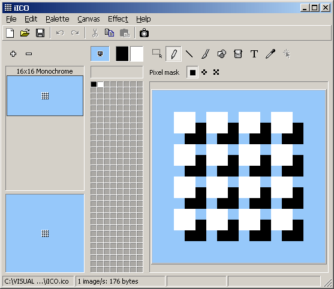



## iICO 1\.0

### Description

All formats icon/cursor editor. 

----

Important: This application has been tested under Windows XP/2000 (NT?). Because of GDI limitations in Windows 9x with geometric* pens, 'brush', 'line' and 'shape' tools will not give desired final appearance. [*Using geometric pens with Paths will end with same results]. 

----

Yes, this little application is still far of some well known professional ones, but, I think is quite complete for a first release, as well as a good example of GDI and GDI+ joining. // All thanks to Avery and Vlad V. // Zip 165 Kb

----

Update 2004.06.28: Fixed W9x memory leak. Thanks Vlad! (and thanks Fred, for all your tests). // Alpha effects now available on selection frame. 

----

Update: See CodeID=54968 (NT/2000/XP).
 
### More Info
 

             |
---                |---
**Submitted On**   |2004-07-12 20:04:38
**By**             |[Carles P\.V\.](https://github.com/Planet-Source-Code/PSCIndex/blob/master/ByAuthor/carles-p-v.md)
**Level**          |Intermediate
**User Rating**    |5.0 (274 globes from 55 users)
**Compatibility**  |VB 6\.0
**Category**       |[Complete Applications](https://github.com/Planet-Source-Code/PSCIndex/blob/master/ByCategory/complete-applications__1-27.md)
**World**          |[Visual Basic](https://github.com/Planet-Source-Code/PSCIndex/blob/master/ByWorld/visual-basic.md)
**Archive File**   |[iICO\_1\_01816331192004\.zip](https://github.com/Planet-Source-Code/carles-p-v-iico-1-0__1-54524/archive/master.zip)

